<div align="center">

# Rama

Navigate your organization, starting with you

[![Live][badge-site]][url-site]
[![HTML5][badge-html]][url-html]
[![CSS3][badge-css]][url-css]
[![JavaScript][badge-js]][url-js]
[![Claude Code][badge-claude]][url-claude]
[![License][badge-license]](LICENSE)

[badge-site]:    https://img.shields.io/badge/live_site-0063e5?style=for-the-badge&logo=googlechrome&logoColor=white
[badge-html]:    https://img.shields.io/badge/HTML5-E34F26?style=for-the-badge&logo=html5&logoColor=white
[badge-css]:     https://img.shields.io/badge/CSS3-1572B6?style=for-the-badge&logo=css3&logoColor=white
[badge-js]:      https://img.shields.io/badge/JavaScript-F7DF1E?style=for-the-badge&logo=javascript&logoColor=black
[badge-claude]:  https://img.shields.io/badge/Claude_Code-CC785C?style=for-the-badge&logo=anthropic&logoColor=white
[badge-license]: https://img.shields.io/badge/license-MIT-404040?style=for-the-badge

[url-site]:   https://rama.neorgon.com/
[url-html]:   #
[url-css]:    #
[url-js]:     #
[url-claude]: https://claude.ai/code

</div>

---

## Overview

Rama draws an org chart from one YAML, JSON or CSV document and opens it on your own card: your
manager above you, your peers beside you, everyone's reports underneath, and the whole org as
rings one click away. Any key you add to a person shows up on their profile, and the same people
go to Floorplan as rooms or to Reparto as a sprint plan through a link, with nothing uploaded.

**Live:** [rama.neorgon.com](https://rama.neorgon.com/)

---

## Features

- **Starts with you** -- a `?me=` link, the card you picked, or the email on your Neorgon account puts you at the centre; with none of them it opens at the top
- **Walk the org** -- click anyone, or use the arrow keys: up to the manager, down to the first report, across to peers; Back walks back
- **Cards that move** -- every card morphs from where it was to where it lands, and the line from the top down to the focused person carries a travelling pulse
- **The whole org at once** -- the overview draws divisions as wedges and levels as rings, coloured by division, team, track, employment or country
- **Profiles with your own fields** -- contact, local time, reporting line, teams with splits, expertise, and any extra key the document carries, labelled and typed through `fields:`
- **Contractors and open roles fold away** -- they collapse into buckets under each manager and open in place
- **One document, three tools** -- hand a manager's org to Floorplan as rooms or their team to Reparto as a capacity plan, through the links those tools already read
- **Search** -- `/` finds people by name, title, team, skill, city or email, accents folded
- **Every way in** -- the editor validates as you type, and YAML, JSON, CSV from an HR tool, Floorplan documents, `#d=` links and `?src=` URLs all go through the same gate
- **Every way out** -- YAML with comments kept, JSON, CSV with formula cells neutralised, Mermaid, a vCard per person, share links, and a ready prompt for Claude

---

## The document

```yaml
title: Lanternfish Systems
people:
  - name: Hana Kobayashi
    email: hana@example.com
    role: eng-director
  - name: Jules Okafor
    role: lead-engineer
    manager: hana-kobayashi
    location: Lagos, Nigeria
    country: NG
    tz: Africa/Lagos
    pronouns: they/them   # any extra key shows up on the profile
```

The full schema, the link contract and the handoff rules are in [`llms.txt`](llms.txt); the sample org is [`examples/lanternfish.yaml`](examples/lanternfish.yaml).

---

## Running locally

ES modules require an HTTP server (not `file://`):

```bash
make serve    # http://localhost:8896
make test     # Node tests over the pure core
```

---

## Architecture



```
rama-site/
├── index.html              # Shell, CSP, header kit contract, dialogs
├── llms.txt                # The document schema, links and handoffs, for people and agents
├── examples/
│   └── lanternfish.yaml    # The invented sample org
├── css/
│   ├── style.css           # Template base: buttons, dialogs, toast
│   ├── chart.css           # Chart, cards, wires, overview, transitions
│   └── panel.css           # Stage bar, profile panel, palette, editor
├── js/
│   ├── app.js              # Entry point
│   ├── schema.js           # The org document: normalizeOrg, orgToDoc
│   ├── teams.js            # Teams in Floorplan's group shape
│   ├── roles.js            # Built-in role catalogue
│   ├── tree.js             # Reporting tree index, focus view, search
│   ├── handoff.js          # Floorplan and Reparto documents and links
│   ├── formats.js          # CSV, Mermaid, vCard
│   ├── docio.js            # Text in and out, #d=, ?src=
│   ├── state.js            # Document, view state, preferences
│   ├── me.js               # Who the visitor is
│   ├── nav.js              # Moving between people, view transitions
│   ├── render*.js, wires.js, overview.js, panel.js, people.js
│   ├── search.js, editor.js, actions.js, boot.js, menus.js, events.js
│   └── neorgon-*.js        # Vendored kits (header, footer, beacon, auth, dom, persist)
├── test/                   # node --test over the pure modules
├── CNAME
├── Makefile
└── README.md
```

---

<div align="center">
<sub>Part of <a href="https://neorgon.com/">Neorgon</a></sub>
</div>
